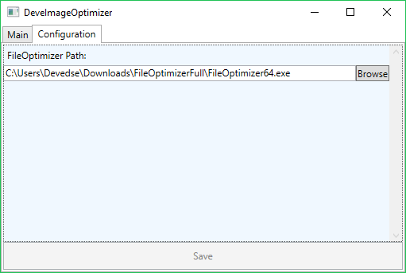

# DeveImageOptimizer
This tool uses FileOptimizer to recompress images: http://nikkhokkho.sourceforge.net/static.php?page=FileOptimizer

## Build status

| Travis (Linux/Osx build) | AppVeyor (Windows build) |
|:------------------------:|:------------------------:|
| (Travis doesn't really build WPF)  |  |

## More information

This tool has some advantages/differences over the GUI for FileOptimizer:

| Number | Description | Implementation progress |
| --- | --- | --- |
| 1 | A basic UI using MVVM Light and some cool features from C# and WPF | 50% |
| 2 | It will remember all processed files, so it won't reprocess them again if they have already been optimized. | 0% |
| 3 | It will do a pixel for pixel comparison between the input/output and only replace the original if it matches 100% (this is just to be sure the image did not get corrupted) | 0% |
| 4 | If you select a folder it will only take PNG's and JPEG's from that folder to optimize, no other formats will be included | 0% |
| 5 | Automated builds / release | Travis-CI: 0%, AppVeyor: 100% |

## Screenshot

